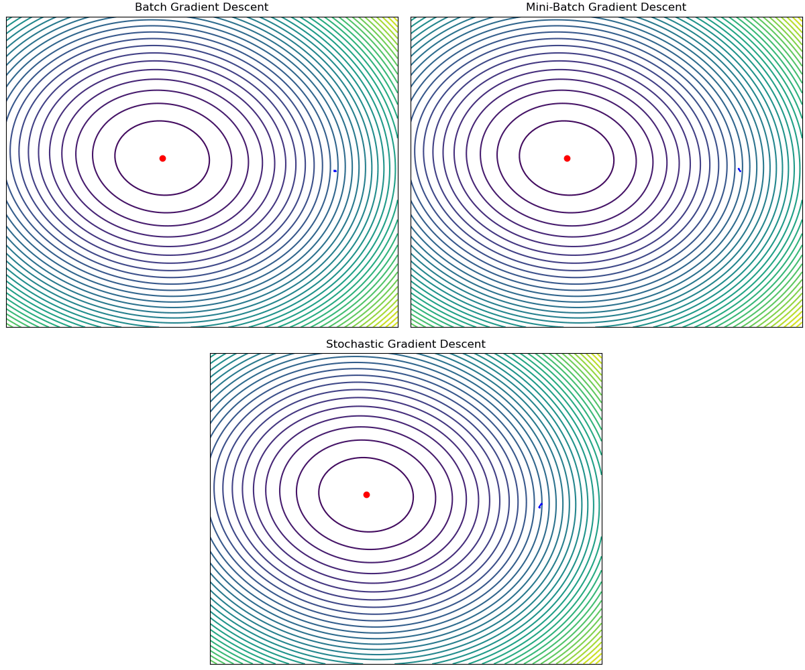

# Introduction to Machine Learning Laboratory

  

Bài tập thực hành môn Nhập môn máy học HK2 20-21  
Nội dung các bài tập Lab:
<ul>
  <li> <b> Lab 01: </b> Warm-up laboratory </li>
  <li> <b> Lab 02: </b> Linear Regression </li>
  <li> <b> Lab 03: </b> Logistic Regression </li>
  <li> <b> Lab 04: </b> Naive Bayes </li>
  <li> <b> Lab 05: </b> KMeans Clustering </li>
  <li> <b> Lab 06: </b> Hiearchical Clustering </li>
  <li> <b> Lab 07: </b> Decision Tree and Random Forest </li>
  <li> <b> Lab 08: </b> Backprobagation </li>
  <li> <b> Lab 09: </b> Introduction to Tensorflow </li>
  <li> <b> Lab 10: </b> Support Vector Machine </li>
</ul>
